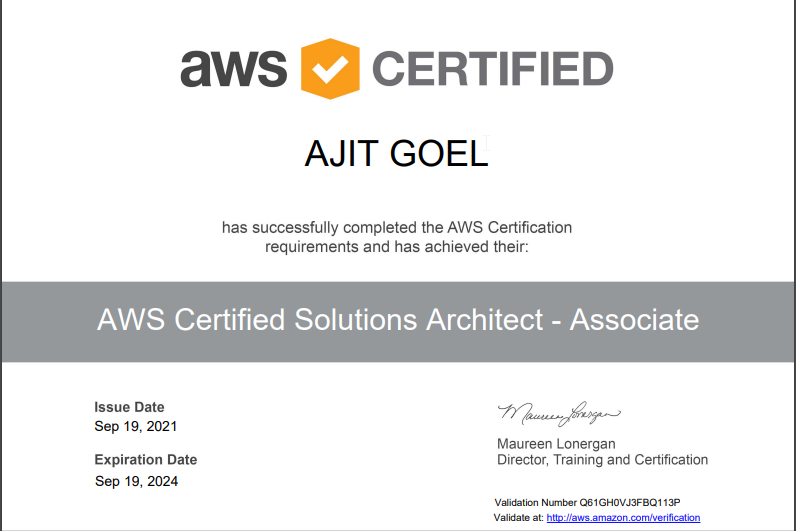

Ajit Goel is a seasoned cloud and leadership specialist with over two decades of professional experience in a variety of environments. He is passionate about technology and value-driven projects, and he is highly adaptable. He has been part of significant industry transformation waves directly from some of the leaders driving the digital era.

**Certifications:** 

