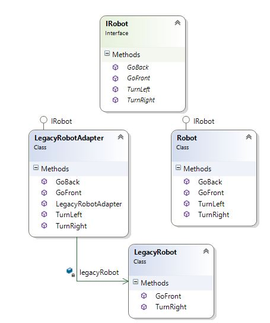

One of my friends recently went to an interview to a very well known startup company. It is supposed to hire only the very best people in the industry. One of the problem that he was asked to white board was:

You have a robot that can turn left and right. It can also move forward and backwards. You also have a legacy robot that can only turn right and move forward. You want the legacy robot to turn left and to move backwards. Design an adapter class that would allow the legacy robot to turn right and to move backwards.

**Solution:**



```
using System;
using System.Collections.Generic;
using System.Linq;
public interface IRobot
{
  void GoFront(int noOfSteps);
  void GoBack(int noOfSteps);
  void TurnRight(int degrees);
  void TurnLeft(int degrees);
}
public class LegacyRobot
{
  public void GoFront(int noOfSteps){}
  public void TurnRight(int degrees){}
}
public class Robot : IRobot
{
  public void GoFront(int noOfSteps){}
  public void GoBack(int noOfSteps){}
  public void TurnRight(int degrees){}
  public void TurnLeft(int degrees){}
}
public class LegacyRobotAdapter : IRobot
{
  LegacyRobot legacyRobot;
  public LegacyRobotAdapter(LegacyRobot legacyRobot)
  {
    this.legacyRobot = legacyRobot;
  }
  public void GoFront(int noOfSteps)
  {
    this.legacyRobot.GoFront(noOfSteps);
  }
  //The legacy robot can go back by turning right by 180 degrees 
  //then going front by the number of steps requested by the client then 
  //turning right by 180 degrees to be facing from where the robot started from.
  public void GoBack(int noOfSteps)
  {
    this.legacyRobot.TurnRight(180);
    this.legacyRobot.GoFront(noOfSteps);
    this.legacyRobot.TurnRight(180);
  }
  public void TurnRight(int degrees)
  {
    this.legacyRobot.TurnRight(degrees);
  }
  //The legacy robot can turn left by turning right by 360 degrees 
  //minus the client requested degrees to turn
  public void TurnLeft(int degrees)
  {
    this.legacyRobot.TurnRight(360 - degrees);
  }
}
```