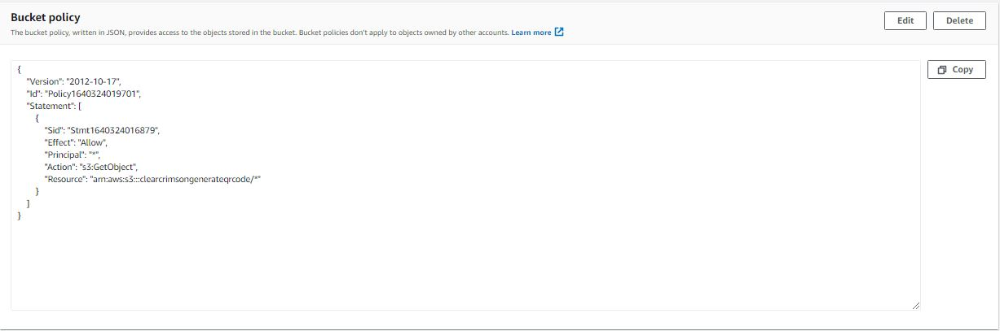

I am developing an application that allows users to create and edit QR codes. The generated QR codes are stored in AWS S3. I was however getting an `access denied `error when trying to access the publicly available QR codes from the application.  To fix this issue, I \
a. Added the following bucket policy using the `bucket policy editor `under `permissions `tab for the AWS S3 bucket. This bucket policy allows a user to access all the resources under the bucket. 

