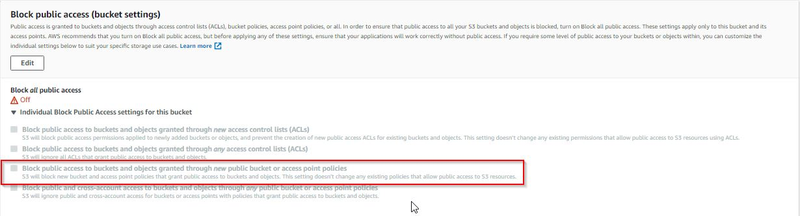

I am developing an application that allows users to create and edit QR codes. The generated QR codes are stored in AWS S3. I was however getting an `access denied`error when trying to access the publicly available QR codes from the application.  To fix this issue, I \
a. under the `Permissions`=> `Block public access (bucket settings)` section, ensure that the `Block public access to buckets and objects granted through`*`new`* checkbox is unchecked. 



b. Under the `Permissions`tab for the AWS S3 bucket, add the following bucket policy using the `bucket policy editor`. This bucket policy allows a user to access all the resources under the bucket. 

```
{
    "Version": "2012-10-17",
    "Id": "Policy1640324019701",
    "Statement": [
        {
            "Sid": "Stmt1640324016879",
            "Effect": "Allow",
            "Principal": "*",
            "Action": "s3:GetObject",
            "Resource": "arn:aws:s3:::clearcrimsongenerateqrcode/*"
        }
    ]
}
```