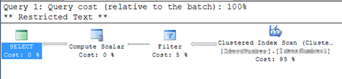
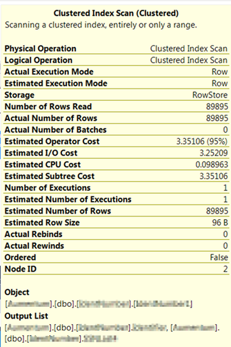
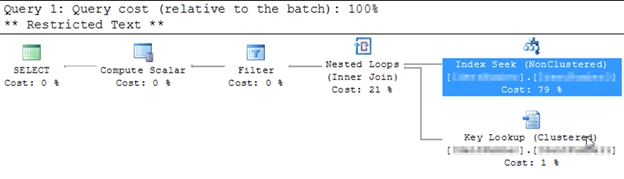
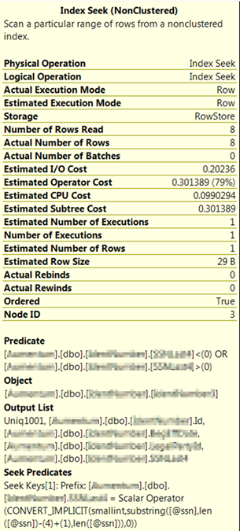

<!--StartFragment-->

We can use database level encryption to encrypt sensitive information. A commonly used level of encryption is to only encrypt columns that contain sensitive information like credit card numbers, date of birth etc. Encrypting and decrypting database level information is very CPU resource intensive. If a column is used as a primary key or used in comparison clauses (WHERE clauses, JOIN conditions) the database will have to decrypt the whole column to perform operations involving those columns.

We faced a similar performance issue in one of the previous companies. Database selects based on SSN were very slow as the database had to decrypt the whole column to perform comparison. If you look at the information below(under **Current Problem**) the database performed 4413 logical reads, 4406 read-ahead reads and took 302 milli seconds to perform the operation.

To improve the performance of these kinds of queries, we decided to store the last four digits of the SSN in clear text and index the column as a non-clustered index. First filtering the rows based on last four digits of the SSN and then filtering the rows based on SSN lead to a dramatic improvement in performance. f you look at the information below(under **Improved Solution**) the database performed 27 logical reads, 10 physical reads 10, 8 read-ahead reads and took 71 milli seconds to perform the operation.\
All in all a huge performance improvement.

**Current Problem:**

```
begin
DBCC FREEPROCCACHE;
DBCC DROPCLEANBUFFERS;
SET STATISTICS TIME ON;
SET STATISTICS IO ON;
 
declare @ssn varchar(max) = '123123123'
with PersonalIdentifierInformationCTE as
(
select CONVERT (CHAR(32), DECRYPTBYKEYAUTOCERT(CERT_ID('CertificateName'), NULL, Identifier)) as Identifier
from PersonalIdentifierInformation
)
select *
from PersonalIdentifierInformationCTE where Identifier is not null
and Identifier=@ssn
end
```

```
DBCC execution completed. If DBCC printed error messages, contact your system administrator.
DBCC execution completed. If DBCC printed error messages, contact your system administrator.
SQL Server Execution Times:
CPU time = 0 ms, elapsed time = 0 ms.
(8 row(s) affected)
Table 'PersonalIdentifierInformation'. Scan count 1, logical reads 4413,
physical reads 3, read-ahead reads 4406, lob logical reads 0,
lob physical reads 0, lob read-ahead reads 0.
(1 row(s) affected)
SQL Server Execution Times:
CPU time = 250 ms, elapsed time = 302 ms.
SQL Server parse and compile time:
CPU time = 0 ms, elapsed time = 0 ms.
SQL Server Execution Times:
CPU time = 0 ms, elapsed time = 0 ms.
```





**Improved Solution:**

```
begin
declare @ssn varchar(max) = '123123123'
 
DBCC FREEPROCCACHE;
DBCC DROPCLEANBUFFERS;
SET STATISTICS TIME ON;
SET STATISTICS IO ON;
 
with PersonalIdentifierInformationCTE as
(
select CONVERT (CHAR(32), DECRYPTBYKEYAUTOCERT(CERT_ID('CertificateName'), NULL, Identifier)) as Identifier, SSNLast4
from PersonalIdentifierInformation
)
select *
from PersonalIdentifierInformationCTE
where SSNLast4<> 0 and SSNLast4 = substring(@ssn, LEN(@ssn)-4+1, LEN(@ssn))
and Identifier is not null
and  Identifier=@ssn
end
```

```
SQL Server parse and compile time:
   CPU time = 0 ms, elapsed time = 0 ms.
 SQL Server Execution Times:
   CPU time = 0 ms,  elapsed time = 0 ms.
SQL Server parse and compile time:
   CPU time = 0 ms, elapsed time = 13 ms.
 SQL Server Execution Times:
   CPU time = 0 ms,  elapsed time = 0 ms.
DBCC execution completed. If DBCC printed error messages, contact your system administrator.
 SQL Server Execution Times:
   CPU time = 0 ms,  elapsed time = 2 ms.
DBCC execution completed. If DBCC printed error messages, contact your system administrator.
 SQL Server Execution Times:
   CPU time = 16 ms,  elapsed time = 16 ms.
 SQL Server Execution Times:
   CPU time = 0 ms,  elapsed time = 0 ms.
 SQL Server Execution Times:
   CPU time = 0 ms,  elapsed time = 0 ms.
    (8 row(s) affected)
Table 'PersonalIdentifierInformation'. Scan count 1, logical reads 27,
physical reads 10, read-ahead reads 8, lob logical reads 0,
lob physical reads 0, lob read-ahead reads 0.
    (1 row(s) affected)
 SQL Server Execution Times:
   CPU time = 0 ms,  elapsed time = 71 ms.
SQL Server parse and compile time:
   CPU time = 0 ms, elapsed time = 0 ms.
 SQL Server Execution Times:
   CPU time = 0 ms,  elapsed time = 0 ms.
```



