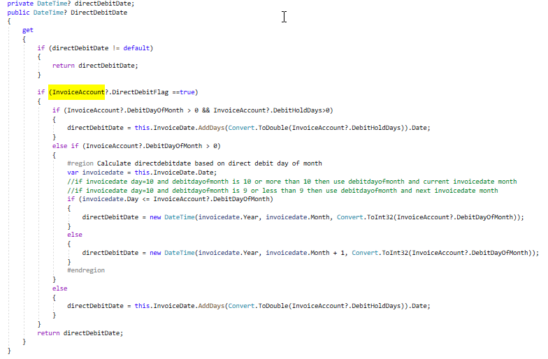

I had a method that needed to be unit tested. However, the method depended on a database context and I did not want to change the class to make it unit testable. \
In the screenshot below, we need to test the readonly DirectDebitDate property but it depends on the database context. 

To make the code unit testable, I created a [Func ](https://docs.microsoft.com/en-us/dotnet/api/system.func-2?view=net-6.0), passed the values from the database context dependency and then unit tested the Func. 

**Unit test that tests the Func, independent of the database dependency:**

